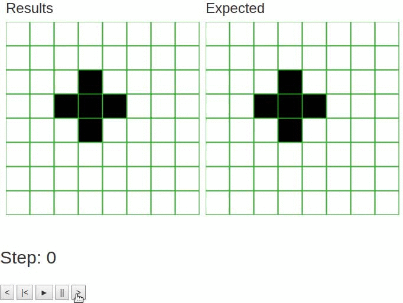

# game-of-life
Visualizer for [Conway's Game of
Life](https://en.wikipedia.org/wiki/Conway%27s_Game_of_Life).

The `javascript` folder is the one that matters. The `python` folder is some skeleton code for when I thought about doing it in Python.

This was implemented for a Digitial VLSI course, in which we implemented
Conway's Game of Life on a circuit. We then ran our simulations through the
ircuit and exported the results to a CSV file. The code in this repo first
converts this data to a JSON object (see
[javascript/csv\_to\_js.py](javascript/csv_to_js.py).

After this script is run (see instructions below), the results and the expected
results can be compared by opening javascript/index.html in a browser. Note that
an internet connection is needed for D3 to download/work in your browser. Below
is a screenshot of the resulting browser:



## Prerequisites
To open the visualizer, you need Google Chrome and an internet connection. It should work on other browsers, but they're not tested.

To load new data, you need `python` and `numpy` installed.

## Instructions
To open the visualizer, open `javascript/index.html` in Google Chrome.

To load new data, go to the `javascript` directory and run
```
$ python csv_to_js.py --csv_file <PATH_TO_CSV.csv>
```
